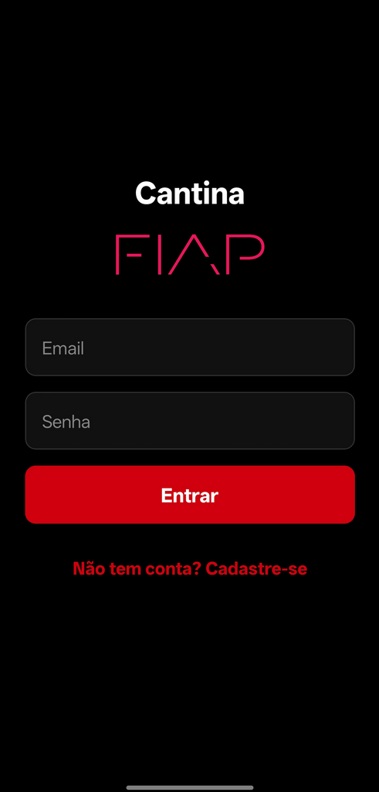
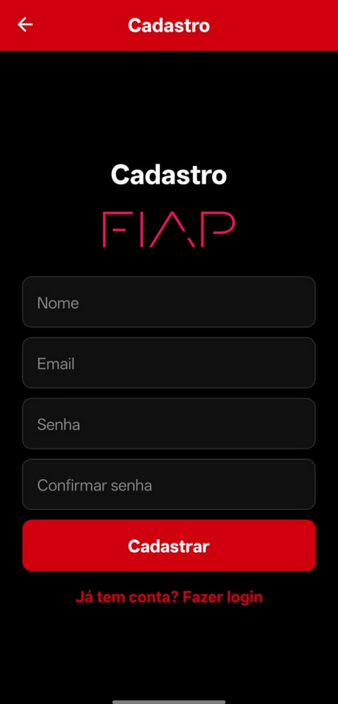

# 🍔 Cantina FIAP - App de Pedidos

## 📱 Sobre o Projeto

### Nome do App

**Cantina FIAP** — Aplicativo mobile para reserva e pré-pedido de itens da cantina.

---

## 🎯 Problema que resolve

O app resolve o problema de **filas e falta de tempo no intervalo** na cantina da FIAP.

Com o aplicativo, os alunos podem:

* Visualizar o cardápio antecipadamente
* Fazer pedidos antes do intervalo
* Saber o valor total antes de chegar
* Retirar o pedido rapidamente, sem filas

---

## 🏫 Contexto

Foi escolhida a operação da **Cantina da FIAP**, pois:

* O intervalo é curto (15–20 minutos)
* Existe grande fluxo de alunos
* Filas são frequentes
* Há perda de tempo e desistência de compra

---

## 🚀 Funcionalidades

### 🔐 Autenticação

* Cadastro de usuário com validação de email FIAP (rm@fiap.com.br)
* Login com validação de credenciais
* Persistência de sessão (AsyncStorage)
* Proteção de rotas (acesso somente logado)

### 🍽️ Cardápio

* Listagem completa de produtos
* Busca dinâmica por nome (filtro em tempo real)
* Interface estilizada (tema FIAP)

### 🛒 Carrinho

* Adição de itens
* Remoção de itens
* Cálculo automático do total
* Persistência entre telas (Context API)
* Resumo fixo do carrinho

### 📦 Pedido

* Tela de revisão do carrinho
* Seleção de forma de pagamento (PIX ou balcão)
* Confirmação com número do pedido
* Feedback visual com Alert
* Simulação de tempo de preparo

### 🎨 Interface

* Tema escuro (preto + vermelho FIAP)
* Layout moderno com cards
* Feedback visual para ações
* Tratamento de estados (loading, vazio, erro)

---

## 🧠 Diferenciais Implementados

* 🔍 Busca no cardápio em tempo real
* 🔐 Sistema de autenticação completo
* 💾 Persistência de dados com AsyncStorage
* 🧩 Uso de Context API (Auth + Carrinho)
* ⚡ Proteção de rotas
* 🎯 UX melhorada (mensagens, estados vazios, loading)
* 💳 Seleção de forma de pagamento no app  
* 🎓 Validação de email no padrão institucional FIAP  

---

## 🛠️ Tecnologias Utilizadas

* React Native
* Expo
* Expo Router
* AsyncStorage
* Context API
* JavaScript (ES6+)

---

## 📂 Estrutura do Projeto

```
app/            # Telas (Home, Login, Cadastro, Cardápio, Carrinho)
components/     # Componentes reutilizáveis
context/        # Contextos (AuthContext, AppDataContext)
constants/      # Dados estáticos (cardápio)
assets/         # Imagens e logo
```

---

## 🚀 Como Rodar o Projeto

### Pré-requisitos

* Node.js
* Expo Go
* Git

### Passo a passo

```bash
# 1. Clone o repositório
git clone https://github.com/YujiSam/fiap-mdi-cp1-cantina-app.git

# 2. Acesse a pasta
cd fiap-mdi-cp1-cantina-app

# 3. Instale as dependências
npm install

# 4. Execute o projeto
npx expo start
```

📱 Depois, escaneie o QR Code com o Expo Go.

---

<h3 align="center">📱 Telas do App</h3>

<p align="center">
  
  
  
  
  
  
</p>

---

## 🎥 Vídeo

[▶️ Ver demonstração do app](https://youtube.com/shorts/FM_1DQVbAH0)

---

## 🔮 Próximos Passos

* Integração com RM FIAP
* Sistema de pagamento
* Notificações push
* Backend real (API)
* Histórico de pedidos

---

## 👨‍💻 Integrante

**Gustavo Yuji Osugi**
RM: 555034

---
