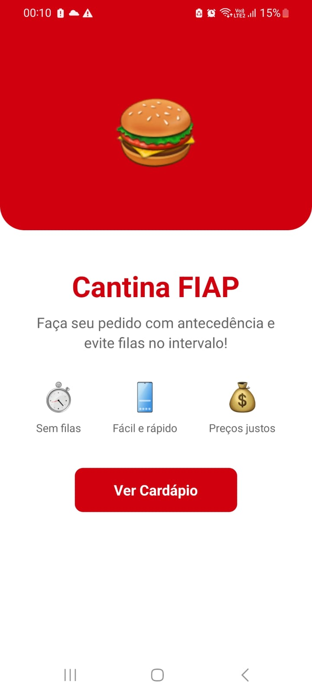
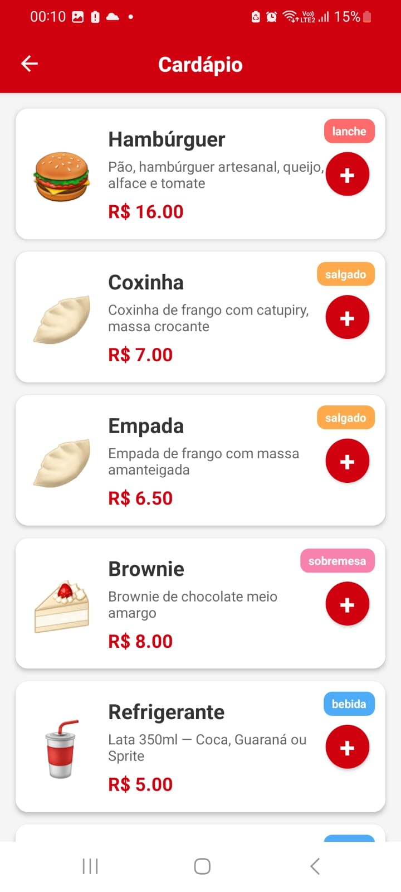
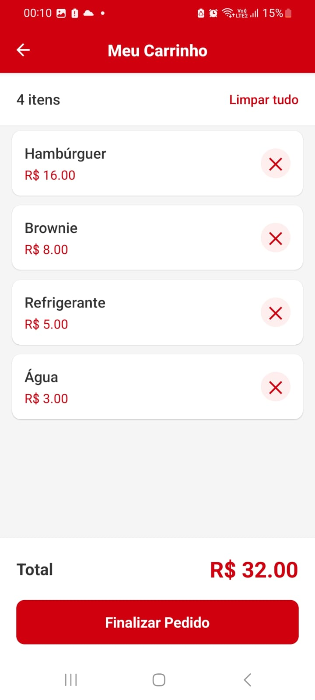
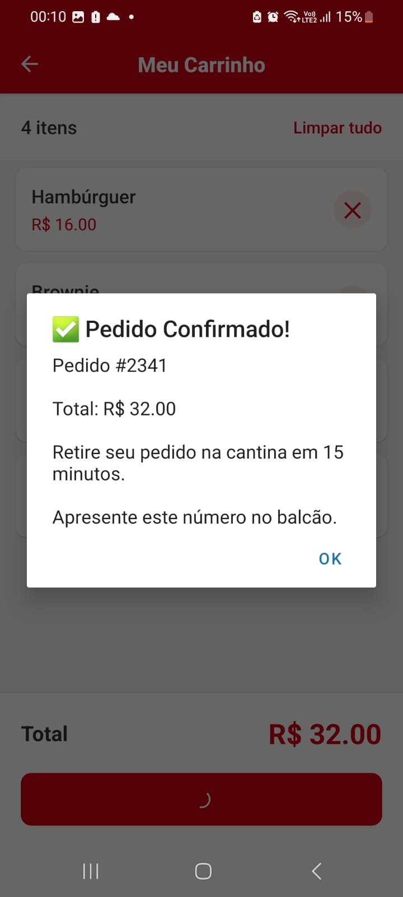

# 🍔 Cantina FIAP - App de Pedidos

## 📱 Sobre o Projeto

### Nome do App
**Cantina FIAP** - App para reserva e pré-pedido de itens da cantina

### Problema que resolve
O app resolve o problema de **filas e incerteza no horário do intervalo** na cantina da FIAP. Com o app, os alunos podem:
- Ver o cardápio antecipadamente
- Fazer o pedido com antecedência
- Saber o valor total antes de chegar na cantina
- Retirar o pedido sem enfrentar filas

### Operação da FIAP escolhida
Foi escolhida a operação da **Cantina da FIAP**, pois:
- É um problema real enfrentado pelos alunos diariamente
- O horário do intervalo é curto (geralmente 15-20 minutos)
- Muitos alunos desistem de comprar por causa das filas
- A cantina fica sobrecarregada nos horários de pico

### Funcionalidades implementadas
✅ Visualização completa do cardápio  
✅ Adição de itens ao carrinho  
✅ Remoção de itens do carrinho  
✅ Cálculo automático do valor total  
✅ Resumo do pedido antes de finalizar  
✅ Confirmação com número do pedido  
✅ Carrinho persistente entre telas  
✅ Tratamento de carrinho vazio  

## 🚀 Como Rodar o Projeto

### Pré-requisitos

Node.js 

Expo Go

Git

### Passo a passo para executar

```bash
# 1. Clone o repositório
git clone https://github.com/YujiSam/fiap-mdi-cp1-cantina-app.git

# 2. Entre na pasta do projeto
cd fiap-mdi-cp1-cantina-app

# 3. Instale as dependências
npm install

# 4. Execute o projeto
npx expo start

# 5. Escaneie o QR Code com o app Expo Go
```

## 💻 Decisões Técnicas

```
Estrutura do Projeto
text
app/           # Telas (Home, Cardápio, Carrinho)
components/    # Componentes reutilizáveis (Botao, ItemCardapio, etc.)
constants/     # Dados do cardápio
Hooks utilizados
useState	Guardar itens adicionados ao carrinho
useState	Controlar loading na finalização
useLocalSearchParams Receber dados do carrinho da tela anterior
```

### Navegação

Expo Router com Stack Navigator (pilha)

router.push() → ir para nova tela

router.back() → voltar

router.replace() → voltar ao início

### Estilização

StyleSheet do React Native

Cores da FIAP: vermelho #D1000F

Flexbox para responsividade

### Diferenciais implementados

✅ Loading nos botões

✅ Tela de "Carrinho vazio"

✅ Feedback visual (Alert ao finalizar)

## 📸 Demonstração

### Prints das telas

#### Tela 1: Tela Inicial (Home)


#### Tela 2: Cardápio


#### Tela 3: Carrinho


#### Tela 4: Confirmação


## 🎥 Vídeo de demonstração

[▶️ Clique aqui para ver o vídeo do app funcionando](https://youtube.com/shorts/baAa9Yk8ep4)

## Próximos Passos 

Login com RM

Notificações push

## Integrante

### Gustavo Yuji Osugi [RM555034]

